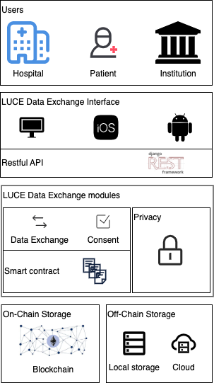

# LUCE Technical Prototype

## Architecture

The architecture of LUCE is shown below.



1. Users:

   - Hospital: represents medical institutions that need to access and input data.
   - Patient: Patients whose data is being managed and exchanged.
   - Institution: Other entities that may need access to the data, possibly for administrative or research purposes.

2. LUCE Data Exchange Interface:

   - The interface supports different platforms, and it communicates with a backend using a RESTful API, a popular choice for web services.

3. LUCE Data Exchange modules:

   - Data Exchange: This module is responsible for the transfer of data between parties.
   - Consent: It ensures that data is not exchanged without the consent of the data owner.
   - Privacy: A module dedicated to maintaining privacy.
   - Smart contract: uses blockchain technology to enforce contracts regarding data access and usage.

4. Storage:
   - On-Chain Storage: Utilizes blockchain technology, storing shared data and meta-data.
   - Off-Chain Storage: Utilizing local storage or cloud storage, to store the raw data and administrative data

## How to launch LUCE (Debug purpose)

### 1. Install docker

- [for linux](https://docs.docker.com/desktop/install/linux-install/)
- [for mac](https://docs.docker.com/desktop/install/mac-install/)
- [for windows](https://docs.docker.com/desktop/install/windows-install/)

### 2. Launch LUCE

#### 2.1 Preliminary

As we are going to launch LUCE with docker, we need some preliminaries.

##### 2.1.1. Compile smart contracts with Brownie

Change directory to `luce_vm/brownie` and run `brownie compile`.

> Tips: We recommend compiling smart contracts locally. Attempting to compile them within a Docker container often requires environment configuration, which can sometimes lead to failures.

### 2.2 Launch LUCE

To launch LUCE, run: `docker compose up`.

### database

LUCE use PostgresQL to keep user information, just run:
`docker compose up`
this command will launch a `postgres_db` container，you can configure it in Django project settings

### Ganache

As ganache-cli has upgrade into a full functional application - [Ganache](https://trufflesuite.com/ganache/), which brings many useful features for debuging. You can configure it as a `HttpProvider`

### Django server

activate your devlopment environment, and start a Django server; generally, go into the root directory of Django project, `luce_django/luce` in this case, and run:
`python manage.py runserver`

## How to access LUCE

You can access with [LUCE API](https://documenter.getpostman.com/view/18666298/2s93sZ7aDm), or with [app](https://github.com/klifish/DecentralizedHealthcare)

### For http request user

1. Step 1: register
2. Step 2: login
   > Once logged in, you can get a token which is necessary for later operation
3. Step 3: upload data

## Document

You can access [LUCE document](https://maastrichtu-ids.github.io/DecentralizedHealthcareBackend/) for details.

## Tips

1. if you encounter the issue:

> `brownie.exceptions.ContractNotFound: No contract deployed at 0xDa574613C62f6DB9FFE8dCC5a8b079Ba37e29390`,

> please go to `luce_vm/brownie`, remove `build/deployment` folder in the brownie directory, and then run `brownie compile`

2. If you got the response:

```
{
    "error": {
        "code": 400,
        "message": "validation error",
        "status": "ERROR",
        "details": "luce registry was not deployed"
    },
    "data": {}
}
```

please deploy a LUCERegistry contract in `admin/deployRegistry/` endpoint.

## Development Manual

For how to maintain the documentation, please refer to: [Documentation mantaince](./docs/README.MD)

For how to develop in LUCE, please refer to: [LUCE development tips](./manual/LUCE%20development%20tips.pdf)
