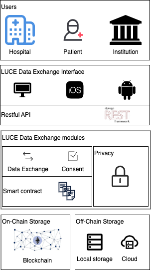

# 🤝 License accoUntability and CompliancE (LUCE)

A Blockchain-based data sharing platform for monitoring data license accountability and compliance.

## 🗺️ Architecture

The architecture of LUCE is shown below.



1. Users:

   - Hospital: represents medical institutions that need to access and input data.
   - Patient: Patients whose data is being managed and exchanged.
   - Institution: Other entities that may need access to the data, possibly for administrative or research purposes.

2. LUCE Data Exchange Interface:

   - The interface supports different platforms, and it communicates with a backend using a RESTful API, a popular choice for web services.

3. LUCE Data Exchange modules:

   - Data Exchange: This module is responsible for the transfer of data between parties.
   - Consent: It ensures that data is not exchanged without the consent of the data owner.
   - Privacy: A module dedicated to maintaining privacy.
   - Smart contract: uses blockchain technology to enforce contracts regarding data access and usage.

4. Storage:
   - On-Chain Storage: Utilizes blockchain technology, storing shared data and meta-data.
   - Off-Chain Storage: Utilizing local storage or cloud storage, to store the raw data and administrative data

## 🚀 How to launch LUCE

### 1. Install docker

- [for linux](https://docs.docker.com/desktop/install/linux-install/)
- [for mac](https://docs.docker.com/desktop/install/mac-install/)
- [for windows](https://docs.docker.com/desktop/install/windows-install/)

### 2. Launch LUCE

Clone the repository:

```bash
git clone https://github.com/MaastrichtU-IDS/DecentralizedHealthcareBackend
cd DecentralizedHealthcareBackend
```

To launch LUCE, run:

````
docker compose up
````

## 🧩 Technical overview

Each component of the LUCE stack is deployed in a different docker container, defined in `docker-compose.yml`

### Django API

User login and access to the contract is managed by a python Django API

Code in the `backend` folder. Django settings in `backend/src/luce/lucehome/settings.py`

### Webapp

React-native ([expo](https://expo.dev/)) JavaScript webapp for users to upload and search for contracts. It uses the Django API

Code in the `frontend` folder

### Zero-Knowledge Proofs

[Snarkjs](https://github.com/iden3/snarkjs)-based server for generating Zero-Knowledge Proofs (ZKPs).

Code in the `zkp_service` folder

### Database

LUCE use PostgresQL to keep user information, you can configure it in Django project settings

### Ganache

[Ganache](https://trufflesuite.com/ganache/) is used to deploy an Ethereum blockchain network for LUCE, available through HTTP

## ℹ️ How to access LUCE

You can access with [LUCE API](https://documenter.getpostman.com/view/18666298/2s93sZ7aDm), or with [app](https://github.com/klifish/DecentralizedHealthcare)

### For http request user

1. Step 1: register
2. Step 2: login
   > Once logged in, you can get a token which is necessary for later operation
3. Step 3: upload data

For more details, please refer to [Understanding the Login Related Process](./manual/understanding%20the%20login%20related%20process.md)

## 🧑‍💻 Development Manual

For how to maintain the documentation, please refer to: [Documentation mantaince](./docs/README.MD)

For how to develop in LUCE, please refer to: [LUCE development tips](./manual/LUCE%20Development%20tips.MD)

Install development dependencies:

```bash
pip install hatch
npm install -g expo-cli
```

1. Start the database and blockchain in docker for development:

```bash
docker compose -f docker-compose.dev.yml up
```

2. Start the backend:

```bash
cd backend
hatch run dev
```

3. Start the frontend:

```bash
cd frontend
npm install
npm run start
```

### Tips

1. if you encounter the issue:

> `brownie.exceptions.ContractNotFound: No contract deployed at 0xDa574613C62f6DB9FFE8dCC5a8b079Ba37e29390`,

> please go to `luce_vm/brownie`, remove `build/deployment` folder in the brownie directory, and then run `brownie compile`

2. If you got the response:

```
{
    "error": {
        "code": 400,
        "message": "validation error",
        "status": "ERROR",
        "details": "luce registry was not deployed"
    },
    "data": {}
}
```

please deploy a LUCERegistry contract in `admin/deployRegistry/` endpoint.
